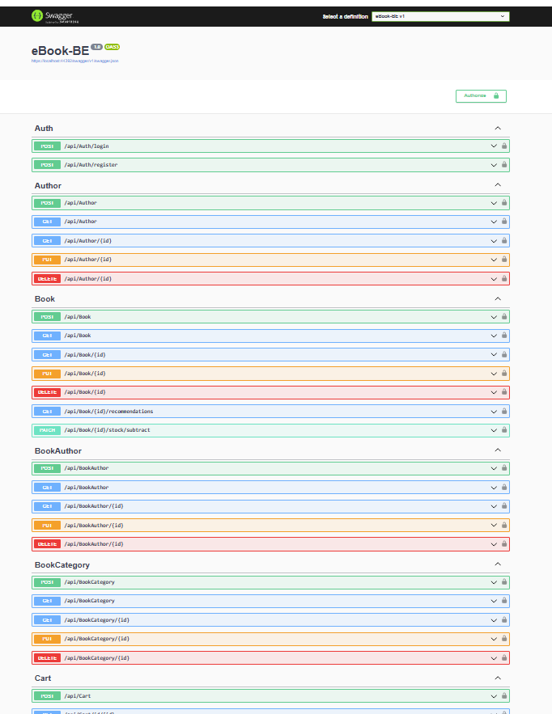

# eBook_BE (Backend API)
ASP.NET Core Web API backend service for the eBook online store, providing secure and efficient endpoints for both the customer-facing website and admin dashboard.

## Features

- Authentication & Authorization: JWT Authentication
- Book Management
- Order Processing
- User Management
- Recommendation System
- Analytics & Reporting

## Requirement
- Development environment:
    - .NET 8.0+
    - Visual Studio 2022
    - SQL Server 2019+ for database
      
## Installation Guide

To install and run the project locally, follow these steps:

1. Clone this repo.
2. Replace ConnectionString
3. Run server.

## Swagger

## Authors

[Lê Quốc Dũng](https://github.com/DungLe2983)

[Phạm Thanh Đồng ](https://github.com/ThanhDong00)

